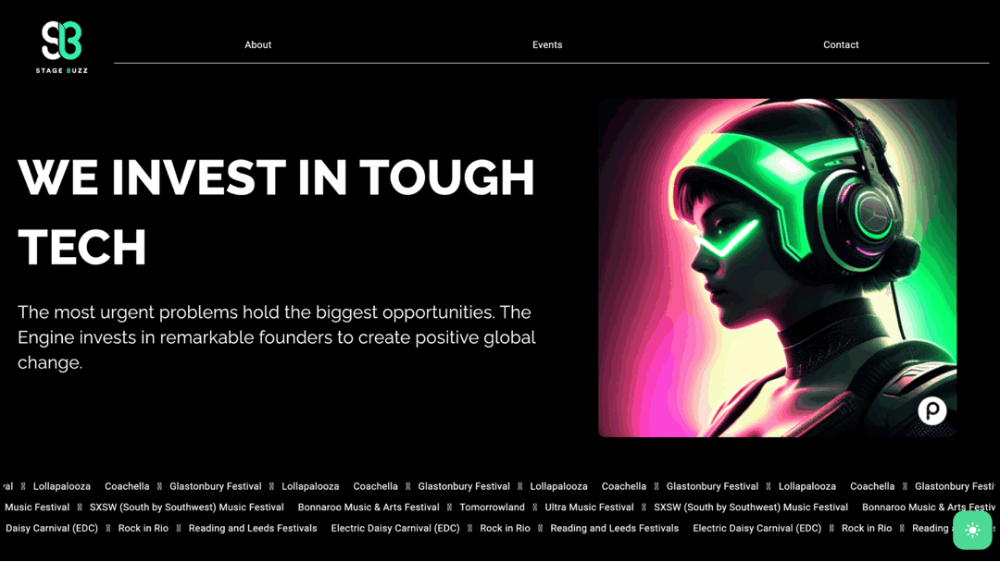

# 🎶 Flutter Concert Showcase (Concept)

A cross-platform Flutter concept app demonstrating a minimal concert discovery interface. The current version includes static views for **About**, **Events**, and **Contact**. Built with Flutter for both web and mobile using a single codebase.

## ✨ Current Features

- 📝 **About Page** — Overview of the app or service
- 📅 **Events Page** — Browse a sample list of upcoming concerts
- 📬 **Contact Page** — Placeholder for contact or support information
- 🌐 Fully responsive for both mobile and desktop screens
- 🚀 Flutter Web support with easy deployment

## 📸 Screenshots


## 🚀 Getting Started

### Prerequisites

- [Flutter SDK](https://flutter.dev/docs/get-started/install)
- Dart >= 3.0.0
- Optional: Android Studio / Xcode for mobile development

### Run the app

```bash
# Get dependencies
flutter pub get

# Run on mobile or emulator
flutter run

# Run on web
flutter run -d chrome
